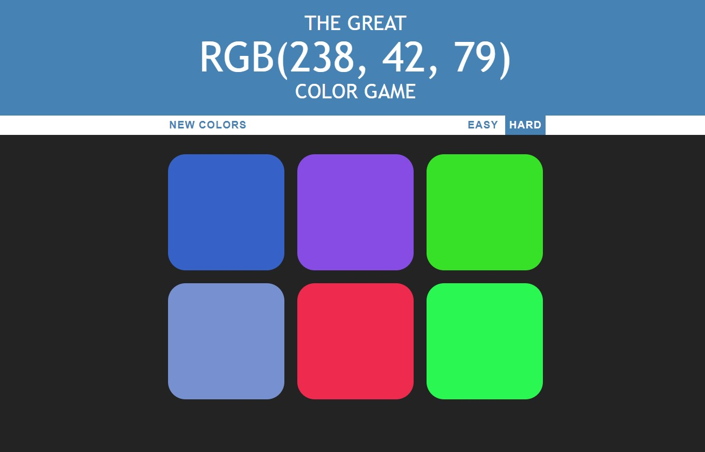

## RGB Color Guessing Game

<em>Built with Html, CSS and JavaScript</em>

- The website presents a RGB code and several color options to choose from.
- The goal is to correctly guess which color matches the given RGB code.
- There are two difficulty levels: hard, with 6 color options, and easy, with 3 color options.

<h2><a href="https://anushkabahuguna.github.io/color_game_website/">Demo</a></h2>

